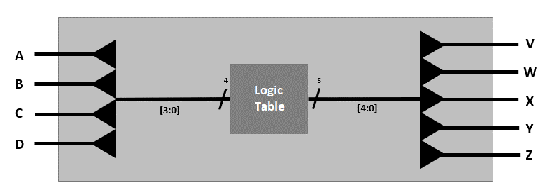
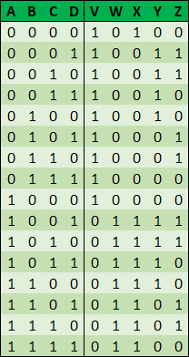
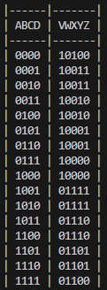

# Logic Table in Verilog

This is a example of how to program a logic table in Verilog. The code was tested on a FPGA using LabsLand's [FPGA Remote Lab](https://www.labsland.com/) service. The code also include a simple testbench to simulate the module using [Icarus Verilog](http://iverilog.icarus.com/).

## Module description

The module has 4 inputs and 5 outputs. Each output is defined by the following logic table:





## How to use it

The module is defined in the file `logic_table.v`. To test the module, you can use the testbench `logic_table_tb.v`. To simulate the module, you can use the following commands:

```bash
iverilog simple_io.v simple_io_tb_console.v
vvp a.out
```

The file `logic_table_labsland.v` is used to implement the module on a FPGA using LabsLand's FPGA Remote Lab service. The inputs and outputs are connected to the switches and LEDs of the FPGA.

## Testbench results

The testbench results are displayed in the following table that shows the same logic table defined in the module.


