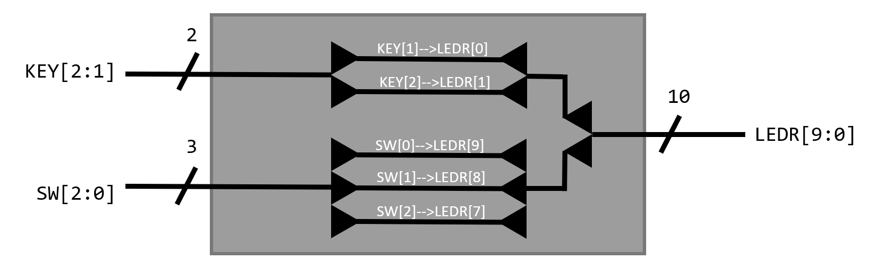
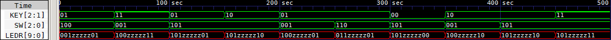

# Simple IO in Verilog

This is a simple example of how to use the IO pins of a FPGA in Verilog. The code was tested on a FPGA using LabsLand's [FPGA Remote Lab](https://www.labsland.com/) service. The code also include a simple testbench to simulate the module using [Icarus Verilog](http://iverilog.icarus.com/) and [GTKWave](http://gtkwave.sourceforge.net/).

## Module description

The module has 5 inputs and 10 outputs. The inputs are connected to the switches and push buttons of the FPGA and the outputs to the LEDs. The module simply copies the inputs to the outputs.


## How to use it

The module is defined in the file `simple_io.v`. To test the module, you can use the testbench `simple_io_tb_console.v` or `simple_io_tb_gtkwave.v`. To simulate the module, you can use the following commands:

```bash
iverilog simple_io.v simple_io_tb_console.v
vvp a.out
gtkwave simple_io_tb_results.vcd
```

## Testbench results

The simulation results are displayed in the following timing diagram, which shows how the inputs are copied to the outputs.

