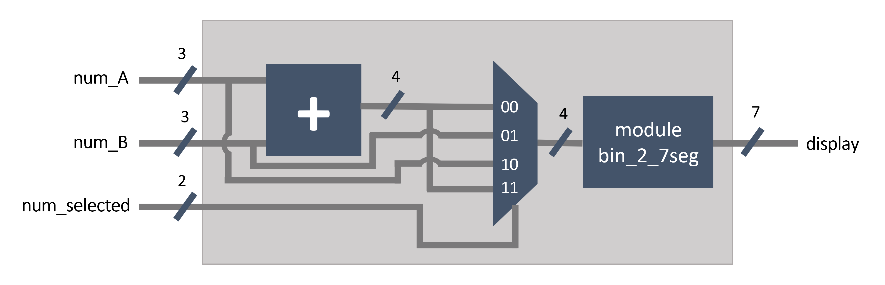
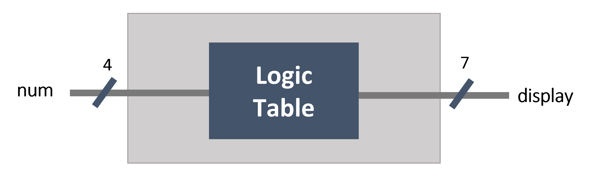
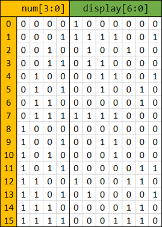
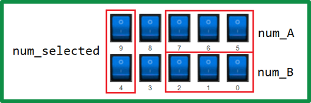
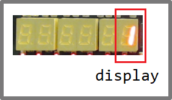
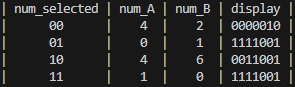

# Sum calculator with 7-segment display

This is an example of a Verilog project that performs addition of two numbers and displays them on a 7-segment display. The project includes a conversion module to convert binary numbers to 7-segment display output. The code was tested on a FPGA using LabsLand's [FPGA Remote Lab](https://www.labsland.com/) service. The code also include a simple testbench to simulate the module using [Icarus Verilog](http://iverilog.icarus.com/).

## Module description

The module takes two 3-bit numbers as inputs and an additional input to select which number to display on the 7-segment display. The output of the module is a 7-bit vector that represents the display output for the selected number.

The conversion module takes a 4-bit binary number as input and outputs the corresponding 7-segment display output as a 7-bit vector.






## How to use it

The main module is defined in the file `sum_calculator.v`. The conversion module is defined in the file `module_bin_2_7seg.v`. To test the module, a testbench is included in the file `sum_calculator_tb.v`. To simulate the module, you can use the following commands:

```bash
iverilog sum_calculator.v module_bin_2_7seg.v sum_calculator_tb.v
vvp a.out
```
To test the module on LabsLand's FPGA Remote Lab service, the file `sum_calculator_labsland.v` is used to implement the module on the FPGA. The inputs and outputs are connected to the switches and 7SEGs of the FPGA.




## Testbench results

The testbench results show that the module correctly performs addition of the two input numbers and displays the selected number on the 7-segment display. The testbench includes various test cases to verify the functionality of the circuit.


